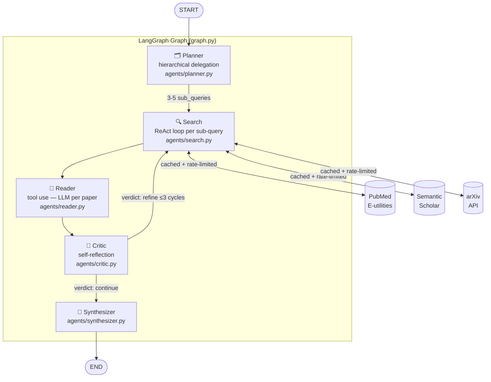

# Clinical Literature Research Agent

This project implements a multi-agent clinical literature research system that demonstrates four agentic patterns in a single cohesive pipeline: **hierarchical delegation** (a Planner that decomposes a question and routes work), **ReAct** (a Search agent that reasons about result quality and refines queries in a loop), tool use (a Reader that calls LLM once per paper to extract structured claims), and **self-reflection** (a Critic that evaluates evidence coverage and drives refinement cycles). The entire graph is orchestrated with **LangGraph**, which makes the control flow — including bounded refinement loops and conditional routing — explicit and inspectable.

---

## Demo

```bash
# 1. Install
pip install -e ".[vertex]"

# 2. Auth (one-time)
gcloud auth application-default login
gcloud config set project clinical-research-agent-494807

# 3. Run
python3 cli.py "What is the current evidence on GLP-1 agonists for non-diabetic weight management?"
python3 cli.py --debug "What is the current evidence on GLP-1 agonists for non-diabetic weight management?"

# Or via installed entry point (add Python bin dir to PATH first — see below)
clinical-research --debug "your question"
```

> **macOS note:** if `clinical-research` is not found after install, add the Python bin dir to PATH:
> ```bash
> echo 'export PATH="/Library/Frameworks/Python.framework/Versions/3.13/bin:$PATH"' >> ~/.zshrc
> source ~/.zshrc
> ```

---

## Architecture



State flows through all nodes as a single `ResearchState` TypedDict (`state.py`).
`papers` and `claims` use `Annotated[list, operator.add]` so they accumulate across
critic-driven refinement cycles without resetting.

---

## Patterns Implemented

| Pattern | Description | File | Entry point |
|---------|-------------|------|-------------|
| **Hierarchical Delegation** | Planner calls LLM to decompose question into 3-5 focused sub-queries; routes work to Search | `agents/planner.py` | [`run_planner` L21](src/clinical_research_agent/agents/planner.py#L21) |
| **ReAct** | Search agent loops: fetch papers → LLM evaluates quality → refine query if needed (max 3 iterations per sub-query) | `agents/search.py` | [`_react_search` L62](src/clinical_research_agent/agents/search.py#L62) |
| **Tool Use** | Reader calls LLM once per paper abstract to extract structured `Claim` objects; only processes papers not yet claimed | `agents/reader.py` | [`run_reader` L21](src/clinical_research_agent/agents/reader.py#L21), [`_extract_claims` L51](src/clinical_research_agent/agents/reader.py#L51) |
| **Self-Reflection** | Critic evaluates claim coverage against the original question; returns `continue` or `refine` with suggested queries; `route_after_critic` enforces the MAX_REFINEMENTS ceiling | `agents/critic.py` | [`run_critic` L21](src/clinical_research_agent/agents/critic.py#L21), [`route_after_critic` L72](src/clinical_research_agent/agents/critic.py#L72) |
| **Graph Orchestration** | LangGraph `StateGraph` wires all nodes; conditional edge drives the critic loop; `operator.add` reducer accumulates papers/claims across cycles | `graph.py` | [`build_graph` L15](src/clinical_research_agent/graph.py#L15) |

---

## Project Structure

```
clinical-research-agent/
  cli.py                          entry point
  pyproject.toml                  pip-installable, hatchling backend
  .env.example                    all configurable env vars
  src/clinical_research_agent/
    state.py                      ResearchState TypedDict + Pydantic sub-models
    config.py                     swappable LLM client (Vertex AI default; Gemini/Anthropic supported)
    graph.py                      LangGraph StateGraph wiring
    _utils.py                     prompt loader, JSON-safe formatter, response parser
    agents/                       one file per agent
    tools/                        pubmed.py, semantic_scholar.py, arxiv.py
    prompts/                      .txt templates, one per agent
    observability/tracing.py      LangSmith opt-in
  evals/
    questions.yaml                10 hand-curated clinical questions
    run.py                        eval harness (citation accuracy, recency, faithfulness, cost, latency)
    metrics.py                    metric implementations
    results.md                    last run output (regenerated by run.py)
  tests/
    test_agents.py                unit tests with mocked LLM
    test_tools.py                 unit + integration tests
```

---

## Quick Start

```bash
# 1. Clone and install
git clone https://github.com/code-kanav/clinical-research-agent
cd clinical-research-agent
pip install -e ".[vertex,dev]"

# 2. Configure .env
cp .env.example .env
# Set in .env:
#   GCP_PROJECT_ID=your-gcp-project
#   GCP_LOCATION=us-central1       (default)
#   NCBI_API_KEY=...               (optional, raises PubMed rate limit)
#   SEMANTIC_SCHOLAR_API_KEY=...   (optional)

# 3. Auth — one-time gcloud setup
brew install --cask google-cloud-sdk   # if not installed
gcloud auth login
gcloud config set project YOUR_GCP_PROJECT
gcloud auth application-default login
# Vertex AI requires a billing-enabled GCP project

# 4. Run
python3 cli.py "What is the evidence for GLP-1 agonists in non-diabetic weight management?"
python3 cli.py --debug "your question"

# Tests (unit only, no network)
pytest tests/

# Integration tests (live APIs)
pytest tests/ --integration
```

---

## Model Provider

Default provider is **Vertex AI** (`gemini-2.5-flash`) via Application Default Credentials.
All agents call `get_llm()` which returns a `langchain_core.BaseChatModel` — swap provider
by changing `LLM_PROVIDER` in `.env`:

| `LLM_PROVIDER` | Auth | Required env vars | Install extras |
|---|---|---|---|
| `vertex` *(default)* | ADC (`gcloud auth application-default login`) | `GCP_PROJECT_ID`, `GCP_LOCATION` | `.[vertex]` |
| `gemini` | API key | `GOOGLE_API_KEY` | `.[gemini]` |
| `anthropic` | API key | `ANTHROPIC_API_KEY` | *(included)* |

**Vertex AI setup** (one-time):
```bash
pip install -e ".[vertex]"
gcloud auth application-default login
# Set GCP_PROJECT_ID in .env — project must have billing enabled
```

A built-in LLM rate limiter enforces a configurable call gap (default 6 s = 10 req/min)
across all agents, preventing quota exhaustion on free-tier projects.

---

## Tool Layer

| Source | API | Rate limit | Cache |
|--------|-----|-----------|-------|
| PubMed | NCBI E-utilities (esearch + efetch) | 3 req/s (10 with `NCBI_API_KEY`) | disk, 7-day TTL |
| Semantic Scholar | Graph API v1 | ~1 req/s (higher with `SEMANTIC_SCHOLAR_API_KEY`) | disk, 7-day TTL |
| arXiv | Atom feed | 1 req/3s | disk, 7-day TTL |

Cache is keyed by `(tool, query, params)` hash. Set `CACHE_TTL_SECONDS=0` to disable.

---

## Evaluation

Run the harness:

```bash
python evals/run.py                    # all 10 questions
python evals/run.py --question-id q01  # single question
python evals/run.py --skip-faithfulness  # skip LLM judge (faster)
```

### Metrics

| Metric | Method |
|--------|--------|
| **Citation accuracy** | Fraction of returned paper IDs matching valid source-specific format (PubMed PMID, S2 paper ID, arXiv ID) |
| **Recency** | Fraction of papers published in the last 3 years |
| **Faithfulness** | LLM-as-judge (Haiku — cheaper model, sufficient for scoring) rates 0–1 coverage of `expected_themes` from `questions.yaml` |
| **Token cost** | `(input_tokens × in_rate + output_tokens × out_rate)` using published 2025-Q2 pricing; tokens accumulated in `ResearchState` across all nodes |
| **Latency** | Wall-clock time per full graph invocation |

Judge calls use the same provider as the main LLM. With Vertex AI, it uses `gemini-2.5-flash`
by default — set `JUDGE_MODEL` in `.env` to override.

### Last Run

_Run `python evals/run.py` to populate this table._

See [`evals/results.md`](evals/results.md) for the full table.

---

## Observability

LangSmith tracing is opt-in. Set `LANGCHAIN_API_KEY` in `.env` to enable:

```bash
LANGCHAIN_API_KEY=ls__...
LANGCHAIN_PROJECT=clinical-research-agent  # optional, default
```

`observability/tracing.py` calls `setup_tracing()` once at CLI startup. When the key is present,
LangGraph emits a trace per run to LangSmith showing:

- All node executions in order (planner → search → reader → critic → synthesizer)
- Each LLM call with prompt, response, and token counts
- Conditional edge routing (continue vs. refine)
- Total run latency

When the key is absent, the call is a no-op — no runtime penalty.

---

## Why This Exists

This is a portfolio project built to demonstrate multi-agent agentic patterns for a
Google Forward Deployed Engineer (GenAI) application. The clinical literature domain was
chosen because it has real APIs (PubMed, Semantic Scholar, arXiv), requires genuine
reasoning about evidence quality (making ReAct and self-reflection non-trivial), and
produces output that is easy to evaluate qualitatively.

It is **not** production software. It has no auth, no persistent storage, no error recovery
beyond the immediate graph run, and has not been evaluated for medical accuracy. Do not use
it for clinical decision-making.

The patterns (ReAct, self-reflection, hierarchical delegation, LangGraph orchestration) are
the point — the domain is the vehicle.
